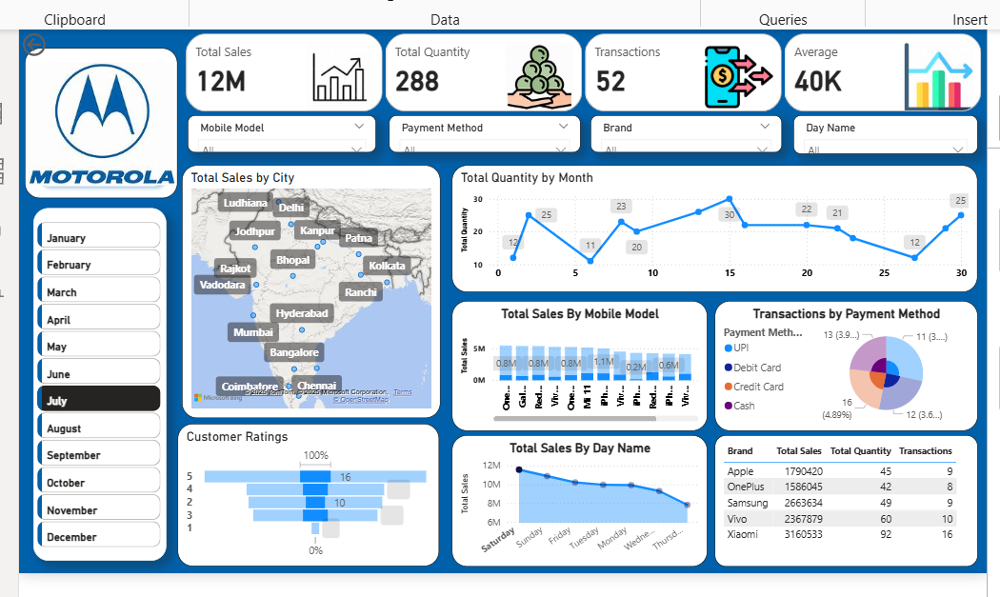

# 📊 Mobile Sales Dashboard - Power BI

An interactive dashboard that visualizes mobile sales data across various cities and brands. Built using Power BI, this report provides insights into:

- 🔢 Total Sales, Quantity, and Transactions
- 🌍 Sales by City (Map visual)
- 📅 Monthly & Day-wise sales trends
- 📱 Sales by Mobile Model & Brand
- 💳 Payment method distribution
- 🌟 Customer Ratings distribution

## 📸 Preview

## 🛠 Tools & Skills Used

- Power BI Desktop
- DAX Expressions
- Data Modeling
- Custom Visuals: Maps, Bar, Pie, Line charts
- Slicer Filters for Month, Brand, Model, Day

## 📚 Credits

Created as part of my learning from **Satish Dhawale's Power BI Skill Course**.

## 📂 Project Files

- `Mobile_Sales_Dashboard.pbix` – Power BI Report
- `Screenshot.png` – Dashboard preview

## 🤝 Connect

Let's connect on [LinkedIn](https://www.linkedin.com/in/sai-sindhu-subbisetty-61b211251/)

---

